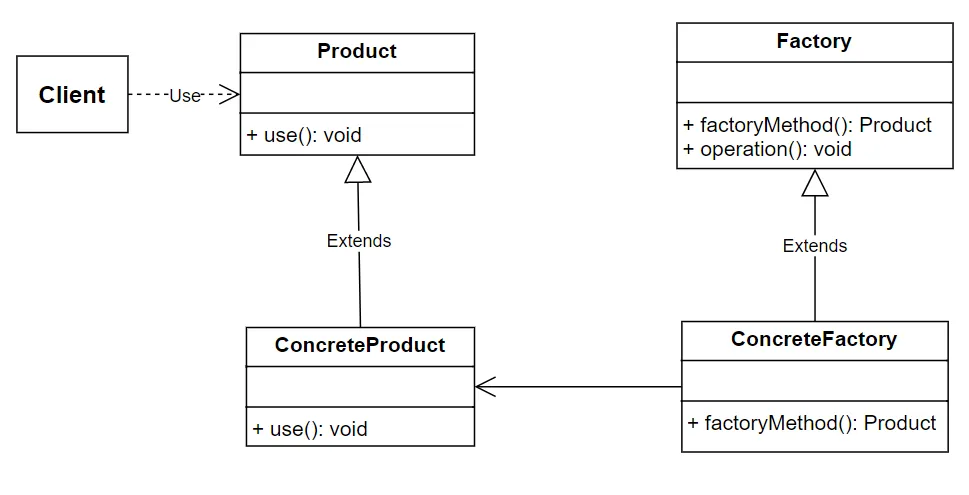

# 设计模式Wiki 

## 1. 工厂模式 FACTORY METHOD 

URL: [Factory Method](https://mp.weixin.qq.com/s?__biz=MzAxNDc5MDYwNw==&mid=2247486481&idx=1&sn=5b60546dea5cff1033551a6ec57aeeda&scene=19#wechat_redirect) 

- 创建型设计模式：一种创建对象的方法，而无需指定具体的类，也不需要直接指定对象的类型。
- 抽象了对象的创建过程:使得客户端只需要通过指定具体的参数，而无需关心对象的创建细节。
- 创建对象的逻辑封装在一个类(工厂类)中, 通过调用工厂类的方法来创建对象的方式, 无需直接使用对象的构造函数  

### Pros & Cons  
- 工厂方法模式的优点：
    - 将对象的创建与使用分离，客户端无需知道具体的产品类，也不需要知道具体产品的实现细节。降低了客户端和具体产品类之间的耦合度。
    - 如果需要更换具体产品类，只需要修改工厂类的实现即可，而不需要修改客户端的代码。
    - 可以在工厂类中实现对象的生命周期管理和对象池等功能。
    - 可以在工厂类中实现对象的复用，如果多个客户端需要同一个对象，可以通过工厂类实现对象的共享，避免重复创建对象。

- 工厂方法模式的缺点：
    - 引入工厂类之后，系统会多出一个类，增加了代码的复杂度和理解难度。
    - 需要额外的工厂类来创建对象，会带来一定的性能开销。
    - 只适用于创建具有相同接口或基类的对象，如果需要创建具有不同接口的对象，该模式不适用。

### 例子 
1. 餐厅根据顾客的下单来订做相应的食物 
2. 汽车厂商通过固定的工厂流水线生产不同型号和外观的汽车 

### 具体架构
工厂方法模式主要包含以下组件：
1. 抽象工厂(Factory)：定义创建产品的接口，包含创建产品对象的抽象方法。
2. 具体工厂(Concrete Factory)：是抽象工厂的具体实现，负责创建具体的产品对象，具体工厂**根据调用场景来决定实例化哪一个具体产品类**，并返回该产品的实例。
3. 抽象产品(Product)：定义了产品的主要特性和功能。
4. 具体产品(Concrete Product)：是抽象产品的具体实现。

组件之间的工作步骤如下：
1. 客户端通过调用具体工厂的方法来创建产品。客户端并不知道具体的产品类，只知道**抽象接口**。
2. 具体工厂接收到客户端的请求后，根据一定的条件来**决定实例化哪一类具体产品**，并调用具体产品类的构造函数。
3. 具体产品类实例化后，将产品返回给客户端使用。  

### 工厂模式通常在以下情况下会非常有用：

- 对象创建逻辑复杂：当对象的创建过程比较复杂，涉及多个步骤或需要多种参数时，工厂模式可以将这些逻辑封装起来，使代码更加清晰和易于维护。
- 需要根据条件创建不同类型的对象：如果你的代码需要根据不同的条件或配置来创建不同类型的对象，工厂模式可以提供一个统一的方式来处理这些情况。
- 解耦对象的创建和使用：工厂模式可以将对象的创建和使用分离，使得代码更加模块化。这样，当对象的创建逻辑发生变化时，不需要修改使用这些对象的代码。
- 需要延迟初始化：当对象的创建成本较高，或者不需要立即创建对象时，工厂模式可以提供延迟初始化（懒加载）的能力。
- 单例模式：在单例模式中，工厂模式可以用来控制对象的创建过程，确保全局只有一个实例。
- 抽象工厂模式：当需要创建一系列相关或依赖的对象时，可以使用抽象工厂模式，它是一种更高级的工厂模式，可以创建多个工厂，每个工厂负责创建一系列相关的对象。
- 接口和实现分离：当你的代码需要与多个实现进行交互，但希望保持接口的独立性时，工厂模式可以提供一个统一的接口来创建不同实现的对象。
- 配置文件或外部输入：当对象的类型和参数需要从配置文件、数据库或外部输入动态确定时，工厂模式可以提供一个灵活的方式来创建对象。

